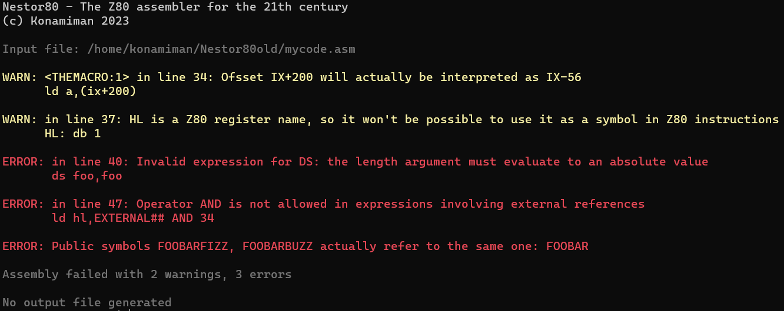
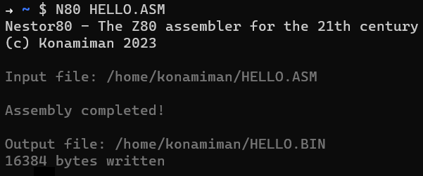
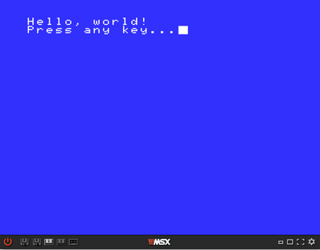

# Nestor80

Nestor80 is [Z80](https://en.wikipedia.org/wiki/Zilog_Z80), [R800](https://en.wikipedia.org/wiki/R800_(CPU)) and [Z280](https://en.wikipedia.org/wiki/Zilog_Z280) assembler written in C# and almost fully compatible with the [Microsoft MACRO-80](https://en.wikipedia.org/wiki/Microsoft_MACRO-80) assembler.

The project also includes Linkstor80 and Libstor80, which are the respective replacements for the LINK-80 and LIB-80 tools that were part of the MACRO-80 package and are relevant when [writing relocatable code](docs/WritingRelocatableCode.md).

## Features highlight

* **Multiplatform**. Runs on any machine/OS that supports [the .NET runtime](https://dotnet.microsoft.com/en-us/download/dotnet/) (.NET 6 or newer); of course this includes Windows, Linux and macOS.

* Almost fully **compatible with [Microsoft MACRO-80](https://en.wikipedia.org/wiki/Microsoft_MACRO-80)** for Z80 code (Nestor80 can't assemble 8080 code). Most of the incompatibilites are for obscure or undocumented features.

* Can produce **absolute and relocatable binary files**. Relocatable files can conform to the format used by Microsoft LINK-80, or to the format used by SDAS and SDLD (the assembler and linker used by [SDCC](https://sdcc.sourceforge.net/)).

* Supports the **Z80 undocumented instructions**.

* Allows disallowing privileged instructions and I/O instructions when assembling Z280 code.

* Over 50 **program arguments** for fine-grained customization of the assembling process and the listing file generation (but all are optional and have sensible defaults). Pass arguments in the command line, in a file, and/or in an environment variable.

* **Detailed, comprehensive error reporting**, unlike MACRO-80:



* Use **unlimited length, arbitrary character encoding symbols** in your code:

```
Ñoñería: ;This is a valid symbol
このラベルは誇張されていますがNestor80がいかに強力であるかを示しています equ 34 ;This too!
```

* **Modern string handling**: it's possible to choose the encoding to be used when converting text strings (supplied as arguments to `DEFB` instructions) to sequences of bytes, and most of the [C# string escape sequences](https://learn.microsoft.com/en-us/dotnet/csharp/programming-guide/strings/#string-escape-sequences) are allowed in strings:

```
  .STRENC 850
HELLO_SP:
  defb "¡Hola en español, esto es fantástico!"

  .STRENC shift_jis
HELLO_JP:
  defb "日本語でこんにちは、これは素晴らしいです！"

  .STRENC default
JOKE:  
  defb "A tab,\ta line feed\nand a form feed\fwalk into a bar...\0"

```

* **User-triggered warnings and errors**, with support for **expression interpolation**:

```
if $ gt 7FFFh
.error ROM page boundary crossed, current location pointer is {$:H4}h
endif
```

* **Nested INCLUDEd files** (MACRO-80 allows only one level for `INCLUDE`) and of course, **support for arbitrary paths** for included files.

* Additionally to being compatible with MACRO-80 it also borrows a few features from other assemblers, like [Sjasm](https://github.com/Konamiman/Sjasm)-style **modules and relative labels**:

```
call GRAPHICS.INIT
call SOUND.INIT
ret

    module GRAPHICS
INIT:
    ;Init graphics
    endmod

    module SOUND
INIT:
    ;Init sound
    endmod

INANE:
    ld b,34
.loop:  ;Actually assembled as INANE.loop
    djnz .loop
    ret

USELESS:
    ld b,89
.loop:  ;Actually assembled as USELESS.loop
    djnz .loop
    ret
```

* **Programmatic API**. The `Assembler.dll` and `Linker.dll` library files can be referenced and used from any .NET language in order to assemble and link code from an IDE or any kind of custom tool. Additionally, they are available as [NuGet](https://www.nuget.org/) packages, with identifiers [_Nestor80_](https://www.nuget.org/packages/Nestor80/) and [_Linkstor80_](https://www.nuget.org/packages/Linkstor80/) respectively.

See the NuGet README files of [Nestor80](NuGet/README_N80.md) and [Linkstor80](NuGet/README_LK80.md) for more details on how to use these library files/NuGet packages.


## Getting started

1. Head to [the releases page](https://github.com/konamiman/Nestor80/releases) and download the appropriate Nestor80 variant for your system. Note that:
   * The "Framework dependant" and "Portable" variants require [the .NET runtime](https://dotnet.microsoft.com/en-us/download/dotnet/) (.NET 6 or newer) to be installed. 
   * The "Standalone" variants don't require the .NET runtime to be installed, but they are much bigger in size (about 60MB vs about 400KB for the framework dependand variants).
   * You'll need the "Portable" variant if your system supports .NET 6 but there isn't a a native variant (standalone or framework dependant) available. To run this variant the `dotnet` tool (installed as part of the .NET runtime) needs to be used as follows: `dotnet N80.dll <arguments>`. Otherwise this variant works exactly like the native ones.

_You may want to get a standalone variant if you just want to give Nestor80 a try, but if you plan to use it regularly the framework dependant variants are recommended._

2. Paste this sample Z80 code (a "hello world" ROM for [MSX computers](https://en.wikipedia.org/wiki/MSX)) in a text file, name it HELLO.ASM:

```
CHGET: equ 009Fh
CHPUT: equ 00A2h

    org 4000h

    db 41h,42h
    dw START
    ds 4010h-$

START:
    call PRINT
    call CHGET
    ret

PRINT:
    ld hl,HELLO
loop:
    ld a,(hl)
    or a
    ret z
    call CHPUT
    inc hl
    jr loop

HELLO:
    db "Hello, world!\r\n"
    db "Press any key...\0"

    ;Padding to get a 16K ROM
    ;(required by some emulators)
    ds 8000h-$
```

3. Run the following: `N80 HELLO.ASM`.



The source will be assembled and a binary file named `HELLO.BIN` will be produced (if you want the file name to be `HELLO.ROM` instead, run `N80 HELLO.ASM HELLO.ROM` or `N80 HELLO.ASM --output-file-extension ROM`).

4. Burn the resulting `HELLO.BIN/.ROM` file in a flash cartridge, insert it in your MSX, and turn it on. Or (probably easier) use an MSX emulator such as [WebMSX](http://webmsx.org/).




## Digging deeper

Here's the full documentation you might want to take a look at before (or while!) using Nestor80 to assemble your Z80 code:

* [**Language reference**](docs/LanguageReference.md), explains the supported assembly language syntax and lists the available pseudo-operators.
* [**Writing relocatable code**](docs/WritingRelocatableCode.md), explains in depth how the process of writing and linking relocatable code works.
* [**Relocatable file format reference**](docs/RelocatableFileFormat.md), details the format of the LINK-80 relocatable files generated by Nestor80.
* [**Z280 support**](docs/Z280Support.md), contains relevant information related to the Z280 processor support. 
* [**SDCC relocatable file format support**](docs/SdccFileFormatSupport.md), contains information related to the SDCC relocatable file format and how Nestor80 builds such files.
* [**Using Nestor80 programmatically**](NuGet/README_N80.md) 
* [**Using Linkstor80 programmatically**](NuGet/README_LK80.md) 


To get the full reference of the existing command line arguments, including how to use environment variables and files to pass arguments, you can run Nestor80 with the `--help` argument; to get help about a specific argument, add the short or the long argument name after `--help`, for example `N80 --help se` or `N80 --help string-encoding`. You can also look at [the help text in the Nestor80 source code](https://github.com/Konamiman/Nestor80/blob/master/N80/Program.Help.cs).


## Building Nestor80

If you want to build Nestor80 itself you have two options:

1. Use [Visual Studio](https://visualstudio.microsoft.com/) (2022 or newer)

Open the Nestor80 solution, right click in the N80, LK80 or LB80 project, and click "Build". If you want to build for a platform other than Windows you'll need to configure the target platform of the projects, see: [How to: Configure projects to target platforms](https://learn.microsoft.com/en-us/visualstudio/ide/how-to-configure-projects-to-target-platforms?view=vs-2022).

2. Use a dedicated script

If you don't have Visual Studio (or you prefer a more automated option) you'll need [the .NET SDK](https://dotnet.microsoft.com/en-us/download/dotnet/) (.NET 7 or newer) to build Nestor80. _The tools target the .NET 6 runtime, but the SDK for .NET 7 or newer is required to build them because the source code uses C#11 syntax that isn't supported by the .NET 6 SDK._

Open a command prompt, go to the root directory of the project and run the `build.sh` script. Running it without arguments will build all the variants, which will be located in the `N80/Release`, `LK80/Release` and `LB80/Release` directories; you can choose which tools and which variants are built by using environment variables, for example:

```
RUNTIMES=linux-x64 PROGRAMS=N80 BUILD_TYPES=FrameworkDependant ./build.sh
```

See the `build.sh` script itself for the available options.

In Linux and macOS you can run the script directly, in Windows 10 and 11 you need to have [WSL](https://learn.microsoft.com/en-us/windows/wsl/install) installed and run it like this: `wsl ./build.sh`


## Bugs! 🐞

The assembler syntax supported by MACRO-80 is quite complex and thus Nestor80 is a complex program. Expect to find bugs in the first few releases, especially when dealing with complex macros and conditional blocks in code; if you are one of the lucky ones, please [submit an issue in GitHub](https://github.com/Konamiman/Nestor80/issues/new) so that I can take a look. Please add as many information as possible to help me reproduce the error, including the error message and the "offending" source code snippet.


## Last but certainly not least

I hope Nestor80 is useful for you. On a completely unrelated and random note, and just in case you feel generous, [my PayPal is open](https://www.paypal.com/cgi-bin/webscr?cmd=_donations&business=konamiman@konamiman.com&item_name=Donation+to+Konamiman+for+Nestor80), just sayin'.
