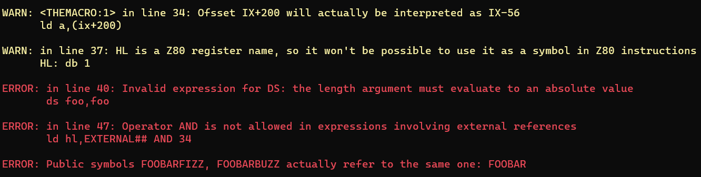

# Nestor80

Nestor80 is [Z80](https://en.wikipedia.org/wiki/Zilog_Z80) and [R800](https://en.wikipedia.org/wiki/R800_(CPU)) assembler written in C# and "fully" compatible with the [Microsoft MACRO-80](https://en.wikipedia.org/wiki/Microsoft_MACRO-80) assembler.

## Features highlight

* **Multiplatform**. Runs on any machine/OS that supports [the .NET 6 runtime](https://dotnet.microsoft.com/en-us/download/dotnet/6.0); of course this includes Windows, Linux and macOS.

* Almost fully **compatible with [Microsoft MACRO-80](https://en.wikipedia.org/wiki/Microsoft_MACRO-80)** for Z80 code (Nestor80 can't assemble 8080 code). Most of the incompatibilites are for obscure or undocumented features.

* Can produce **absolute and relocatable binary files**. Relocatable files conform to the format used by Microsoft LINK-80.

* Supports **Z80 undocumented instructions** and **[R800](https://en.wikipedia.org/wiki/R800_(CPU)) instructions**.

* Over 50 **program arguments** for fine-grained customization of the assembling process and the listing file generation (but all are optional and have sensible defaults). Pass arguments in the command line, in a file, and/or in an environment variable.

* **Detailed, comprehensive error reporting**, unlike MACRO-80:



* Use **unlimited length, arbitrary character encoding symbols** in your code:

```
Ñoñería: ;This is a valid symbol
このラベルは誇張されていますがNestor80がいかに強力であるかを示しています equ 34 ;This too!
```

  _When generating relocatable code, public and external symbols are still limited to ASCII-only and up to 6 characters in length, this is a limitation of [the relocatable file format used by LINK-80](docs/RelocatableFileformat.md)._

* **Modern string handling**: it's possible to choose the encoding to be used when converting text strings (supplied as arguments to `DEFB` instructions) to sequences of bytes, and all of the [C# string escape sequences](https://learn.microsoft.com/en-us/dotnet/csharp/programming-guide/strings/#string-escape-sequences) are allowed in strings:

```
  .STRENC 850
HELLO_SP:
  defb "¡Hola en español, esto es fantástico!"

  .STRENC shift_jis
HELLO_JP:
  defb "日本語でこんにちは、これは素晴らしいです！"

  .STRENC default
JOKE:  
  defb "A tab,\ta line feed\nand a form feed\fwalk into a bar...\0"

```

* **User-triggered warnings and errors**, with support for **expression interpolation**:

```
if $ gt 7FFFh
.error ROM page boundary crossed, current location pointer is {$:H4}h
endif
```

* **Nested INCLUDEd files** (MACRO-80 allows only one level for `INCLUDE`) and of course, **support for arbitrary paths** for included files.

* [Sjasm](https://github.com/Konamiman/Sjasm)-style **modules and relative labels**:

```
call GRAPHICS.INIT
call SOUND.INIT
ret

    module GRAPHICS
INIT:
    ;Init graphics
    endmod

    module SOUND
INIT:
    ;Init sound
    endmod

INANE:
    ld b,34
.loop:  ;Actually assembled as INANE.loop
    djnz .loop
    ret

USELESS:
    ld b,89
.loop:  ;Actually assembled as USELESS.loop
    djnz .loop
    ret
```

* **Programmatic API**. The `Assembler.dll` library file can be referenced and used from any .NET language in order to assemble code from an IDE or any kind of custom tool. Here's a simple example in C#:

```C#
var sourceStream = File.OpenRead("PROGRAM.ASM");
var assemblyConfig = new AssemblyConfiguration() { BuildType = BuildType.Absolute };
var assemblyResult = AssemblySourceProcessor.Assemble(sourceStream, Encoding.UTF8, assemblyConfig);
sourceStream.Close();

if(!result.HasErrors) {
	var outputStream = File.Create("PROGRAM.BIN");
	OutputGenerator.GenerateAbsolute(assemblyResult, outputStream);
	outputStream.Close();
	
	var listingStreamWriter = File.CreateText("PROGRAM.LST");
	var listingConfig = new ListingFileConfiguration() { TitleSignature = "My simple assembler" };
	ListingFileGenerator.GenerateListingFile(assemblyResult, listingStreamWriter, listingConfig);
	listingStreamWriter.Close();
}
```

## Getting started

1. Head to [the releases page](https://github.com/konamiman/Nestor80/releases) and download the appropriate Nestor80 variant for your system. Note that:
   * The "Framework dependant" and "Portable" variants require [the .NET 6 runtime](https://dotnet.microsoft.com/en-us/download/dotnet/6.0) to be installed. 
   * The "Standalone" variants don't require the .NET runtime to be installed, but they are much bigger in size (about 60MB vs about 400KB for the framework dependand variants).
   * You'll need the "Portable" variant if your system supports .NET 6 but there isn't a a native variant (standalone or framework dependant) available. To run this variant the `dotnet` tool (installed as part of the .NET runtime) needs to be used as follows: `dotnet N80.dll <arguments>`. Otherwise this variant works exactly like the native ones.

_You may want to get a standalone variant if you just want to give Nestor80 a try, but if you plan to use it regularly the framework dependant variants are recommended._

2. Paste this sample Z80 code (a "hello world" ROM for [MSX computers](https://en.wikipedia.org/wiki/MSX)) in a text file, name it HELLO.ASM:

```
CHGET: equ 009Fh
CHPUT: equ 00A2h

    org 4000h

    db 41h,42h
    dw START
    ds 4010h-$

START:
    call PRINT
    call CHGET
    ret

PRINT:
    ld hl,HELLO
loop:
    ld a,(hl)
    or a
    ret z
    call CHPUT
    inc hl
    jr loop

HELLO:
    db "Hello, world!\r\n"
    db "Press any key...\0"

    ;Padding to get a 16K ROM
    ;(required by some emulators)
    ds 8000h-$
```

3. Run the following: `N80 HELLO.ASM`.


The source will be assembled and a binary file named `HELLO.BIN` will be produced (if you want the file name to be `HELLO.ROM` instead, run `N80 HELLO.ASM HELLO.ROM` or `N80 HELLO.ASM --output-file-extension ROM`).

4. Burn the resulting `HELLO.BIN/.ROM` file in a flash cartridge, insert it in your MSX, and turn it on. Or (probably easier) use an MSX emulator such as [WebMSX](http://webmsx.org/).


## Digging deeper

Here's the full documentation you might want to take a look at before (or while!) using Nestor80 to assemble your Z80 code:

* [**Program reference**](docs/ProgramReference.md), details all the nuances of running Nestor80, including a list of the available command line arguments.
* [**Language reference**](docs/LanguageReference.md), explains the supported assembly language syntax and lists the available pseudo-operators.
* [**Relocatable file format reference**](docs/RelocatableFileformat.md), details the format of the LINK-80 relocatable files generated by Nestor80.
* [**Porgrammatic API**](docs/ProgrammaticAPI.md), all you need to know if you want to use Nestor80 to assemble Z80 code from your own .NET-capable code.


## Building Nestor80

If you want to build Nestor80 itself you have two options:

1. Use [Visual Studio](https://visualstudio.microsoft.com/) (2022 or newer)

Open the Nestor80 solution, right click in the N80 project, click "Publish" in the menu, select the publish profile for the desired variant and click the "Publish" button.

2. Use a dedicated script

If you don't have Visual Studio you'll need [the .NET 6 SDK](https://dotnet.microsoft.com/en-us/download/dotnet/6.0) to build Nestor80 (installing the SDK gets you the runtime too).

Open a command prompt, go to the `N80` directory and run the `build.sh` script. Running it without arguments will build all the variants;
to build just one pass its name (the name of the corresponding `.pubxml` file in the `N80\Properties\PublishProfiles` directory) as an argument,
e.g. `./build.sh FrameworkDependant__linux_x64`.

In Linux and macOS you can run the script directly, in Windows 10 and 11 you need to have [WSL](https://learn.microsoft.com/en-us/windows/wsl/install) installed
and run it like this: `wsl ./build.sh`

In call cases Nestor80 will be built in the `N80/Release` directory.


## Bugs! 🐞

The assembler syntax supported by MACRO-80 is quite complex and thus Nestor80 is a complex program. Expect to find bugs in the first few releases, especially when dealing with complex macros and conditional blocks in code; if you are one of the lucky ones, please [submit an issue in GitHub](https://github.com/Konamiman/Nestor80/issues/new) so that I can take a look. Add as many information as possible to help me reproduce the error, including the error message and the "offending" source code snippet.


## Last but certainly not least

I hope Nestor80 is useful for you. On a completely unrelated and random note, and just in case you feel generous, [my PayPal is open](https://www.paypal.com/cgi-bin/webscr?cmd=_donations&business=konamiman@konamiman.com&item_name=Donation+to+Konamiman+for+Nestor80), just sayin'.